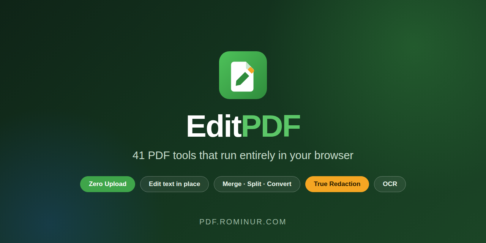
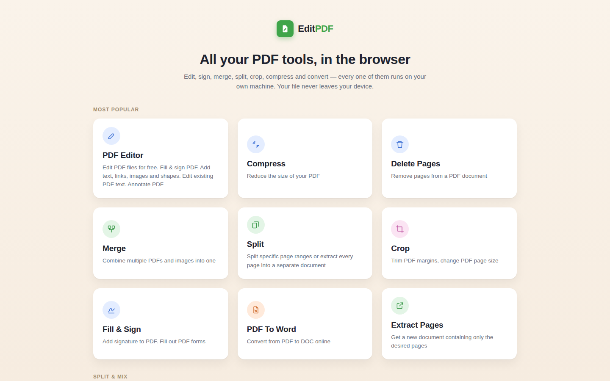

<div align="center">


### 41 PDF tools that run entirely in your browser

**Edit text in place · Merge · Split · Convert · OCR · True redaction**<br>
Your file never leaves your device — because there is no server to send it to.

<br>

[](https://pdf.rominur.com)
[](LICENSE)
[](#-privacy-by-architecture)

[](https://react.dev)
[](https://vitejs.dev)
[](https://pdf-lib.js.org)
[](https://mozilla.github.io/pdf.js/)
[](https://tesseract.projectnaptha.com/)
[](https://github.com/romizone/sejda-lookalike/actions)

<br>



</div>

---

## 🔒 Privacy by architecture

Most online PDF tools ask you to upload your file. For a holiday itinerary that is fine. For a
contract, a payslip, a medical result or a scanned passport it is a transfer of custody, and a
privacy policy is the only thing standing between your document and whatever the operator does
with it.

**EditPDF removes the transfer instead of promising to handle it well.**

| | Typical online PDF tool | EditPDF |
|---|---|---|
| Where your file goes | Uploaded to a server | Stays in the browser tab |
| What you must trust | A privacy policy | Nothing — open DevTools and look |
| Retention window | However long they keep it | None; there is no storage |
| Works offline | ❌ | ✅ after first load |
| Account required | Usually | Never |

> There is no upload endpoint, no processing queue and no retention policy — not because they are
> well managed, but because **they do not exist**. Open your browser's network panel and verify it
> yourself.

---

## ✨ Highlights

<table>
<tr>
<td width="33%" valign="top">

### ✍️ Edit like a document
Click a paragraph and **retype it in place** — in the document's own font. Whiteout regions, drop
in images, shapes and signatures, then fill and sign forms.

</td>
<td width="33%" valign="top">

### 🛡️ Redaction that is real
A black rectangle leaves the text extractable underneath. EditPDF **rebuilds marked pages as
images**, so the words are gone for good — and says so before you commit.

</td>
<td width="33%" valign="top">

### 🔤 Fonts that fit
Bundled **metric-compatible** faces mean rewritten lines take the same width as the original, so
your layout never shifts under you.

</td>
</tr>
</table>

<div align="center">

</div>

---

## 🧰 The 41 tools

<details open>
<summary><b>✏️ Edit &amp; Sign</b> — 8 tools</summary>

| Tool | What it does |
|---|---|
| 🖊️ **PDF Editor** | Edit existing text in place, add text, links, images, shapes, whiteout |
| ✍️ **Fill & Sign** | Fill form fields, draw or place a signature |
| 📋 **Create Forms** | Turn a flat PDF into a fillable one |
| 💧 **Watermark** | Text or image watermark, any opacity and angle |
| 🔢 **Page Numbers** | Numbering with position and format control |
| 📑 **Header & Footer** | Repeating running heads |
| ⚖️ **Bates Numbering** | Continuous legal numbering |
| 🏷️ **Stamp** | Place a reusable stamp on any page |

</details>

<details open>
<summary><b>🗂️ Organise</b> — 15 tools</summary>

| Tool | What it does |
|---|---|
| 🔗 **Merge** | Combine PDFs and images into one |
| 🔀 **Alternate & Mix** | Interleave pages from two files |
| ✂️ **Split** | By page range |
| ➗ **Split in Half** | Two-up scans into single pages |
| 📏 **Split by Size** | Cap each output at a file size |
| 🔎 **Split by Text** | New document whenever text matches |
| 🔖 **Split by Bookmarks** | One document per bookmark |
| 📤 **Extract Pages** | Pull a subset into a new file |
| 🗑️ **Delete Pages** | Remove pages |
| 🧩 **Organize** | Drag to reorder |
| 🔄 **Rotate** | Any page, any angle |
| 🖼️ **Crop** | Trim margins, change page size |
| 📐 **Resize** | Scale to another paper size |
| 🔳 **N-up** | Several pages onto one sheet |
| ↔️ **Flip** | Mirror horizontally or vertically |

</details>

<details open>
<summary><b>🔄 Convert</b> — 7 tools</summary>

| Tool | What it does |
|---|---|
| 📝 **PDF → Word** | `.docx` with text and layout |
| 📊 **PDF → Excel** | Tables to `.xlsx` |
| 📽️ **PDF → PowerPoint** | Pages to slides |
| 📃 **PDF → Text** | Plain text extraction |
| 🖼️ **PDF → JPG** | Rasterise at your chosen DPI |
| 📎 **JPG → PDF** | Images into a document |
| 🎞️ **Extract Images** | Pull embedded images out |

</details>

<details open>
<summary><b>🔐 Protect</b> — 5 tools</summary>

| Tool | What it does |
|---|---|
| 🔒 **Protect** | Password + granular permissions (print, copy, modify) |
| 🔓 **Unlock** | Remove a known password |
| 🧊 **Flatten** | Freeze form fields and annotations |
| ⬛ **Redact** | Destroy content — not paint over it |
| 🧽 **Remove Annotations** | Strip comments and markup |

</details>

<details open>
<summary><b>🩺 Repair &amp; Refine</b> — 6 tools</summary>

| Tool | What it does |
|---|---|
| 🗜️ **Compress** | Real image downscaling |
| 🎞️ **Grayscale** | Convert to greyscale |
| 👁️ **OCR** | Make a scan searchable (Tesseract, in-browser) |
| 🔧 **Repair** | Recover a damaged file |
| 🔖 **Create Bookmarks** | Build an outline |
| ℹ️ **Edit Properties** | Title, author, subject, keywords |

</details>

---

## 🚀 Quick start

```bash
git clone https://github.com/romizone/sejda-lookalike.git
cd sejda-lookalike
npm install
npm run dev          # http://localhost:5173
```

| Script | Purpose |
|---|---|
| `npm run dev` | Development server with hot reload |
| `npm run build` | Production bundle into `dist/` |
| `npm run preview` | Serve the built bundle locally |

> **No environment variables. No API keys. No backend.** The build output is a folder of static
> files you can host anywhere — GitHub Pages, Netlify, Vercel, S3, or a USB stick.

---

## 🏗️ Architecture

```
        ┌──────────────────────────────────────────────┐
        │              your browser tab                │
        │                                              │
   file │   ┌─────────┐   ┌──────────┐   ┌─────────┐   │  download
  ──────┼──▶│ PDF.js  │──▶│  editor  │──▶│ pdf-lib │───┼──────────▶
        │   │ render  │   │  model   │   │  write  │   │
        │   │ extract │   └──────────┘   └─────────┘   │
        │   └─────────┘         │                      │
        │                 ┌─────▼─────┐                │
        │                 │ tesseract │  OCR (WASM)    │
        │                 └───────────┘                │
        └──────────────────────────────────────────────┘
                    ✗ no network hop at any stage
```

No single JavaScript library both reads and writes PDF well, so the two are split by strength:

| Library | Used for | Cannot do |
|---|---|---|
| **PDF.js** | Rendering pages, text extraction, geometry | Author a document |
| **pdf-lib** | Pages, annotations, form fields, drawing, metadata | Render a page; encrypt |
| **@cantoo/pdf-lib** | Password protection with permissions | — |
| **fontkit** | Embedding and subsetting faces for new text | — |
| **tesseract.js** | OCR, compiled to WebAssembly | — |

---

## 🌐 Browser support

| Browser | Supported |
|---|---|
| Chrome / Edge 110+ | ✅ |
| Firefox 110+ | ✅ |
| Safari 16.4+ | ✅ |
| Mobile browsers | ✅ small files; large documents are limited by device memory |

---

## ⚖️ Known trade-offs

Stated openly, because they follow from the design rather than from neglect:

- **Your device is the computer.** A 500-page scan is bounded by the memory your browser grants
  the tab. A server-backed competitor will be faster on very large files.
- **Redaction costs searchability.** Marked pages become images. This is the correct trade, and it
  is still a trade.
- **Conversion is inference.** A PDF never recorded which lines were a table, so complex layouts
  convert approximately.
- **Substituted fonts are not the original.** Metric compatibility preserves the layout, not the
  letterforms.
- **No automation surface.** With no backend there is no API and no batch queue.

---

## 🗺️ Roadmap

- [ ] Batch processing across multiple files in one pass
- [ ] Offline PWA install with a service worker
- [ ] Digital signature verification
- [ ] Extra OCR language packs
- [ ] Keyboard-first command palette

---

## 🤝 Contributing

Issues and pull requests are welcome. See [CONTRIBUTING.md](CONTRIBUTING.md) for the workflow,
[SECURITY.md](SECURITY.md) for reporting vulnerabilities, and
[CODE_OF_CONDUCT.md](CODE_OF_CONDUCT.md) for the ground rules.

## 📄 License

[MIT](LICENSE) © [Romi Nur Ismanto](https://rominur.com)

Bundled Liberation fonts are licensed under the SIL Open Font License — see
[`public/fonts/LICENSE.txt`](public/fonts/LICENSE.txt).

<div align="center">
<br>

**[Open the app](https://pdf.rominur.com)** · [Technical paper](https://rominur.com/EditPDF_Paper.html) · [More projects](https://rominur.com)

<sub>Built by <a href="https://rominur.com">Romi Nur Ismanto</a> · Jakarta, Indonesia</sub>

</div>
